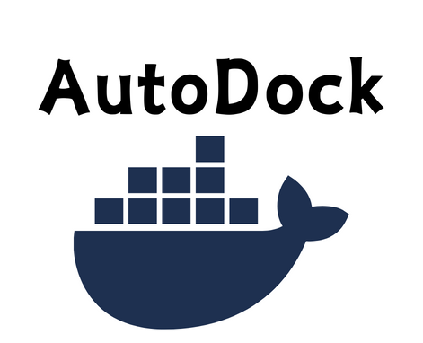

AutoDock is a command-line tool for generating Docker and Docker Compose files based on specified base images using Google Generative AI

## Installation

```
npm install autodock
```

## Setup

.env file
```
API_KEY="YOUR_GEMINI_PRO_KEY"
```

## Usage

```
autodock -f "Dockerfile" -b "node"
```
Personalise your images
```
autodock -f "docker-compose.yml" -b "ubuntu,"node","redis"
```

## Docker build

```
docker build -t test-app .
```
```
docker run -p 3000:3000 test-app
```

### Uninstall

```
npm unistall autodock
```


